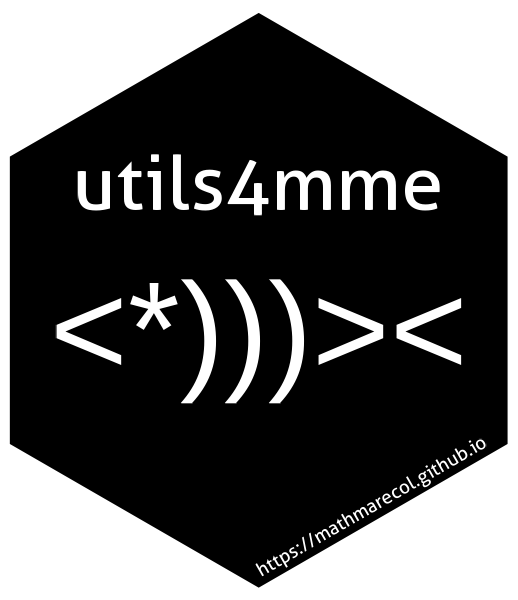

<!-- README.md is generated from README.Rmd. Please edit that file -->

# utils4mme <a href="https://github.com/MathMarEcol/utils4mme"></a>

<!-- badges: start -->

[](https://lifecycle.r-lib.org/articles/stages.html#experimental)
<!-- badges: end -->

`utilsmme` is collection of utilities developed by and for the
[Mathematical Marine Ecology Lab
(MME)](%22https://mathmarecol.github.io%22) at the University of
Queensland. They are intended for use within the lab to facilitate ease
of code-sharing and reducing the amount of repetitive code that must be
maintained. The authors of this package compiled the functions and
maintain the package, but the author of the individual functions are
indicated in the function help.

Some functions in this package will work for all users, but many will
require access to the UQ Research Data Manager (RDM). For the funcations
that require UQ data, you will need to download and expand
`MME1DATA-Q1215/SpatialPlanning/SpatPlan_Data.zip`. To use the
`utils4mme` package defaults, expand this file into your home directory
(e.g. `/Users/jason/SpatPlan_Data`).

You can use any location you want, but you will need to specify the
location for some functions, as per the function help. **Note:** The
download is only 2GB, but the expanded data is 35 GB in size. If you
need help subsetting the data to your region due to memory or HD space
constraints, contact the developers. If you run into memory problems,
you can try increasing the amount of the HD space gdal is allowed to
use. `Sys.setenv(GDAL_MAX_BAND_COUNT = 120000)`

## Installation

You can install the development version of `utils4mme` with:

``` r
if (!require(remotes)) install.packages("remotes")
remotes::install_github("https://github.com/MathMarEcol/utils4mme")
```
